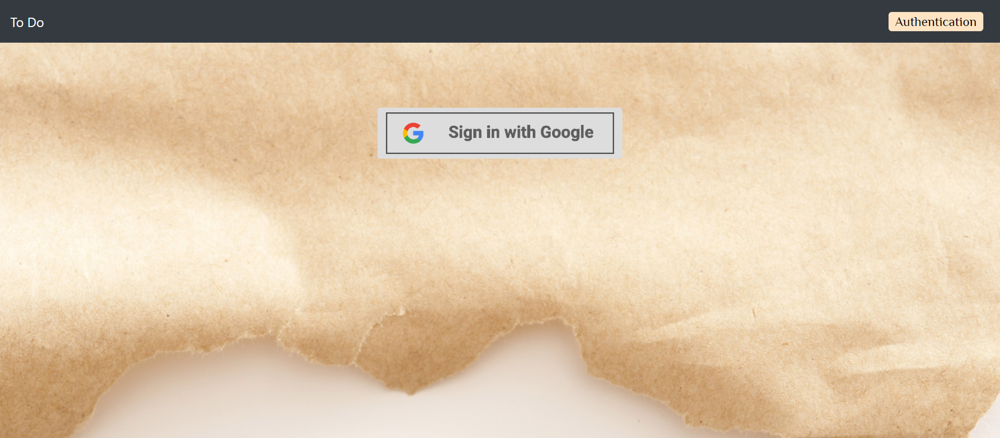
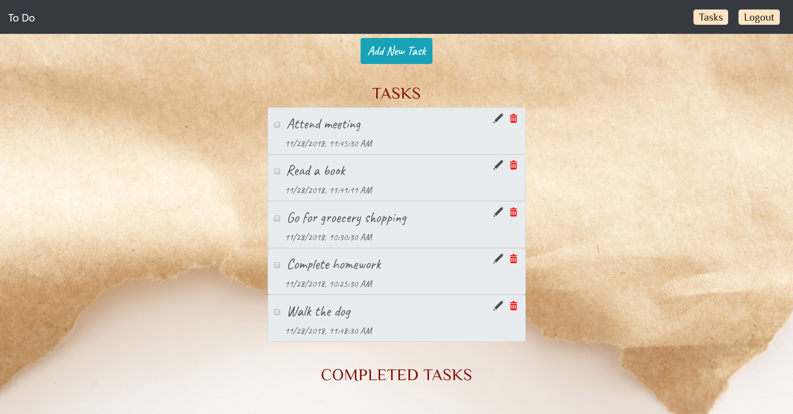
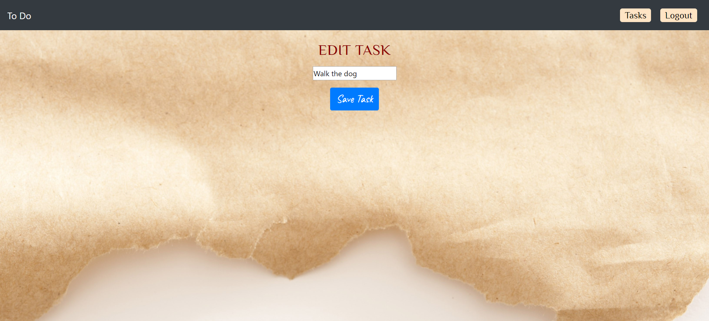
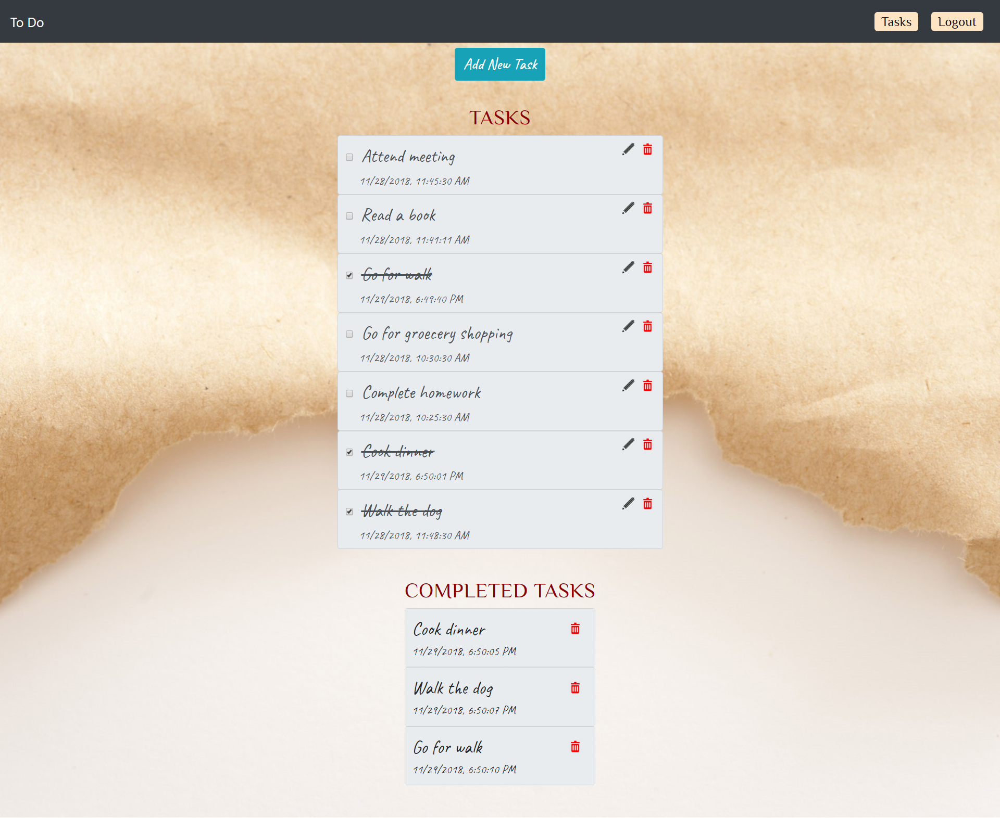

# To-do-App

### Description
This project is an exploration of Firebase for To Do app. When the page is loaded, it asks user to login. Upon login, User will be able to see list of tasks that are open. Users have an ability to add task. They can delete and edit tasks. Upon completion, it will move to completed tasks and cross out the open task.

1. Login Page

2. Tasks Page

3. Add Task Page

4. Edit Page

5. Completed Tasks

### Technologies Used
* Firebase
* SASS
* Webpack
* Axios
* ES6 Modules

### How to run this app
To run this app you will need a firebase account and a new project.
1. Install node, if it's not install.

2.  Configure Firebase
* In the db folder rename `apiKeys.json.example` to `apiKeys.json`
* Add in the config object from your firebase project

3.  Serve up the app
* At the root of the project: `npm install`
* `npm start`
